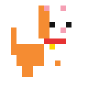
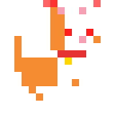
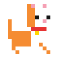

# Anti-WorkCat 😾 ("Nee thurakku... njan adakkam") 🎯


## Basic Details
### Team Name: TechHack


### Team Members
- Team Lead: Vaishnavi P B - LBSITW
- Member 2: Harsha Hari - LBSITW

### Project Description
Anti-WorkCat is a mischievous, roaming desktop pet cat designed to destroy your productivity. It monitors active windows and browser tabs in real-time, gets irritated when you open productive apps or study websites (VS Code, LeetCode, GeeksforGeeks, Claude AI, ChatGPT, PDFs), and marches over to smash them closed while giving iconic dialogues!

### The Problem (that doesn't exist)
People are working way too hard. Society is overloaded with focus timers, pomodoro apps, and productivity trackers. Nobody is taking enough time to scroll Instagram Reels, binge Netflix, or pet a cat.

### The Solution (that nobody asked for)
An aggressive, zero-patience desktop pet cat that:
1. **Monitors active windows & browser tabs** in real-time.
2. **Gets irritated** when you attempt to code, study, or use AI assistants.
3. **Locates the exact tab position via UI Automation** and marches over to smash the active tab closed (`Ctrl+W` for browser tabs, `WM_CLOSE` for apps).
4. **Curls up and sleeps** when idle for > 2 seconds, and **giggles with meow audio & a heart** when clicked!

## Technical Details
### Technologies/Components Used
For Software:
- Languages used: Python 3, JavaScript (ES6+), HTML5, CSS3
- Frameworks used: Vanilla JS / HTML5 (Web Simulator) + Native Win32 API
- Libraries used: Pillow (PIL), uiautomation, comtypes, ctypes, winsound
- Tools used: VS Code, Git, PyInstaller

For Hardware:
- N/A (Software Desktop Pet & Web Simulator)

### Implementation
For Software:
# Installation
```bash
git clone https://github.com/int-main-vaish/useless_project_temp.0.git
cd useless_project_temp
pip install pillow uiautomation comtypes
```

# Run
```bash
# Step 1: Generate Pixel Cat Sprites
python generate_assets.py

# Step 2: Run Desktop Pet!
python anti_workcat.py
```

### Project Documentation
For Software:

# Screenshots (Add at least 3)

*Anti-WorkCat roaming transparently across the desktop*


*Cat walking over to a productive tab and executing paw smash "Bleh ;)"*


*Cat sleeping after 2 seconds idle & giggling with heart reaction when clicked*

# Diagrams

*State Machine: IDLE / SLEEPING → Active Window Check → UI Automation Tab Locating → Walk to Tab → Paw Smash Ctrl+W → Dialogue & Audio Reaction*

For Hardware:

# Schematic & Circuit
N/A (Software Project)

# Build Photos
N/A (Software Project)

### Project Demo
# Video
[🎥 Watch the Project Demo](./demou.mp4)
*Demonstrates active tab detection, UI Automation target walking, tab closing (Ctrl+W), sleeping when idle, and giggling with meow audio when clicked*

# Additional Demos
Open `index.html` in any browser to launch the Web Interactive Desktop Simulator!

## Team Contributions
- Vaishnavi P B: Concept design, Win32 API integration, Python desktop pet development, state machine logic, and tab closing engine.
- Harsha Hari: Web simulator development, UI/UX glassmorphic design, sprite generation, soundboard, and audio integration.

---
Made with ❤️ at TinkerHub Useless Projects 


